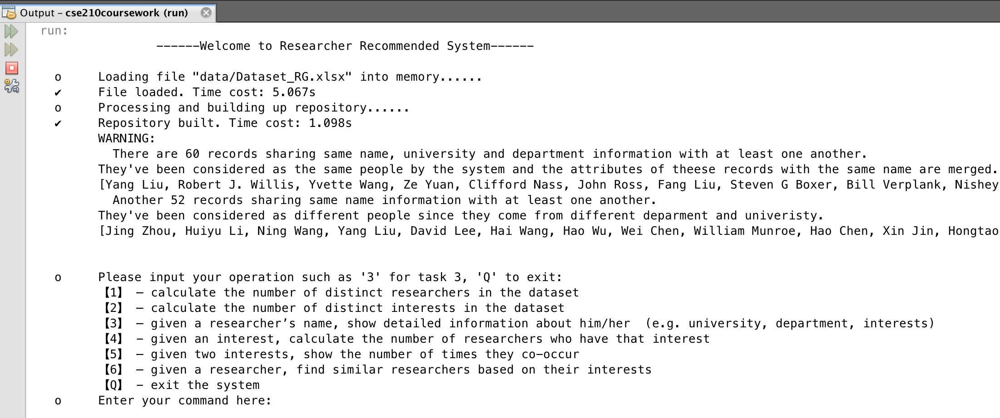
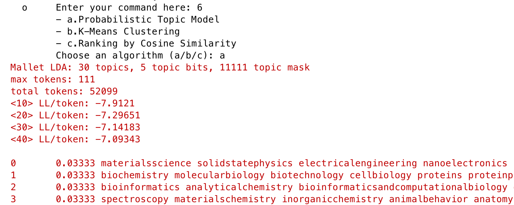
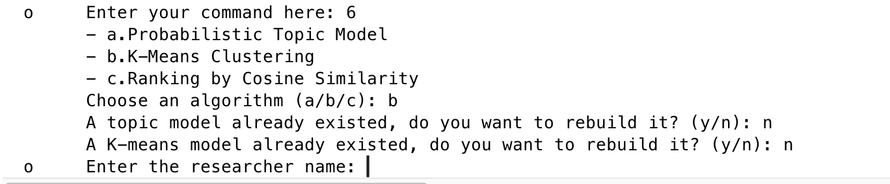
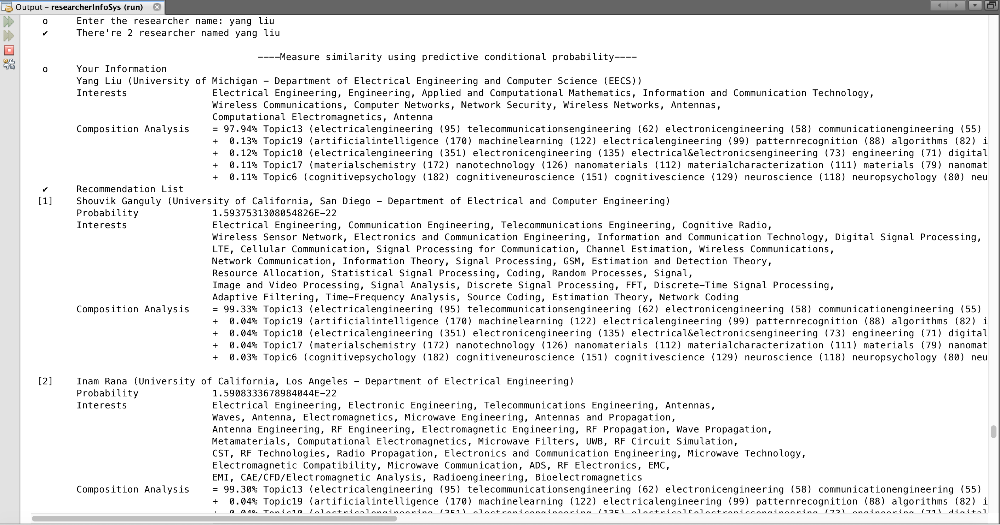

## README - Researcher Info System 

@(CSE210 coursework)[recommended system][clustering|cosine Similarity|k-means|probabilistic topic model|KL divergence]
Researcher Information System is a practical Java application for data processing and simple analysis. The dataset consists of records of researchers crawled from the website [ResearchGate](https://www.researchgate.net) by Mr. Hang Dong, in the Excel format. 
The simple analysis of data are implemented in the most efficient way using appropriate data structures and techniques. Besides a series of basic functionalities, it offers recommendation service by which a set of researchers with similar interest are picked using various optional algorithms. 

---
[TOC]

### Prerequisites
These instructions will get you a copy of the project up and running on your local machine for development and testing purposes. 

- **Netbeans** - an integrated development environment (IDE) for Java. Visit the [official website](https://netbeans.org/downloads/index.html) and download Java SE IDE available for your operating system.  
- **Source Code** -  download the zip file `cse210coursework.zip` from [ICE](https://ice.xjtlu.edu.cn/). You will see the `researcherInfoSys` folder containing the source code of the project after unzipping it. 
- **External API package** -  download the external API package `lib.zip`. Unzip it before copying the entire `lib` folder to the root directory of  `researcherInfoSys`.
- **Dataset** -  the dataset file `Dataset_RG.xlsx` should be put in the `data` folder under root directory of `researcherInfoSys`, which has already been  there. Data file produced by the program will be saved in this folder as well.
> **Note: **  Since Java code uses the relative path. Please make sure that the dataset `Dataset_RG.xlsx` and external libraries `lib` folder has been put in the right directory before going to the next step. 
> ```  
> cse210coursework
>     ├── README.pdf
>     └── researcherInfoSys
>         └── data
>             └── Dataset_RG.xlsx
>         ├── Lib
>         └── ...
    └── documentation
        ├── README.md
        └── javadoc
            ├── index.html
            └── ...
```

### Testing
These instructions will helps you run the project in Netbeans IDE and test a series of functionalities using command line interface.
####  Run the Program in Netbeans
>**Click: ** *file ---> open project ---> cse210coursework ---> run project ( or `F6` )*
#### Test Basic Functionalities
As shown below, a command line interface will be displayed initially, through which you can test each functionality simply by entering *`number 1 to 6`*, which represents *`Task-1 to Task-6`* respectively.

> **Note: ** For some of the tasks, you will be asked to provide the corresponding necessary parameters.  For example, you need to type in two interests string in *Task-5*. Basically, the name of the researcher and interests are *`case-insensitive`*.  Useless blanks will be *`trimmed`* at two heads and multiple blanks between words will be considered as one additionally.

#### Use Recommended System
A similar interface to the figure below  will be displayed the first time you run *Task-6* , during which you are asked to choose the algorithm for recommendation before seeing a bunch of log information that presents the iterations in the building process of the topic model. 


However it's up to you whether to rebuild or reuse the model after the first time, depending on whether your are satisfied with previous recommended results .  Enquiry tips will be given as shown below. 


> **Note: ** For the `k-Means Clustering` algorithm, if the topic model is  chosen to rebuilt, the k-Means model based on it will be rebuilt as well, no matter whether  or not a k-Means model has already existed.

In the end, a list of recommended researchers with similar interest will be given to you just like the figure shown below, arranged in the descending order of similarity. The name of the algorithm and indicator value for each instance are given as well.



### Built With

* [Apache POI](https://poi.apache.org/download.html#POI-3.17) - Java API for manipulating Microsoft Excel file
* [Weka](https://www.cs.waikato.ac.nz/~ml/weka/) - Data Mining software in Java including  API to implement K-Means clustering
* [Mallet](http://mallet.cs.umass.edu) - a Java-based package for machine learning applications including topic modeling.

### Author

* **Yuxuan Guo** - *1507792*  - [yuxuan.guo15@student.xjtlu.edu.cn](mailto: yuxuan.guo15@student.xjtlu.edu.cn)
*Department of Computer Science and Software Engineering*, 
Xi'an Jiaotong Liverpool University